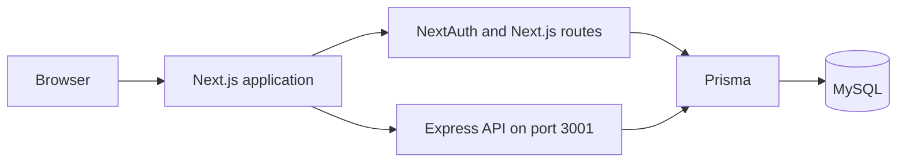

# Full-Stack E-commerce Platform

An adapted electronics-commerce application with customer shopping flows and an administrative dashboard.

> This repository is based on an existing open-source project. It should not be interpreted as wholly original work. See [Attribution](#attribution) and [My Contribution](#my-contribution).

## Overview

The application connects product discovery, authentication, cart, wishlist, checkout, orders, and administrative management in a Next.js storefront backed by MySQL services.

The target users are customers shopping for electronics and administrators managing products, categories, orders, and user records.

## Implemented Features

- Product catalogue, detail pages, search, sorting, and filters
- Credentials-based authentication with NextAuth
- Cart and wishlist state
- Validated checkout and order creation flows
- Administrative product, category, order, and user screens
- Product-image upload handling
- Prisma-backed MySQL schemas
- Express API for commerce operations

## My Contribution

The original application architecture, design, documentation, screenshots, and most implementation were created by the upstream authors credited below.

Verified maintenance work in this local copy includes:

- Configuring and debugging credentials authentication with Prisma-backed users
- Refining login request and redirect handling
- Adding reusable Prisma client setup for local development
- Extending category data with a unique slug and adding the related migration
- Adding database seed support and local seed data
- Improving environment-variable hygiene and removing a route that exposed database configuration
- Replacing the inherited README with an accurate contribution and attribution record

The repository was imported as a single initial commit, so it does not preserve the upstream commit history or support a claim of complete individual ownership.

## Technology Stack

### Frontend and application

- Next.js 14 App Router
- React 18 and TypeScript
- Tailwind CSS, Headless UI, Flowbite React, and DaisyUI
- Zustand for cart, wishlist, pagination, and sorting state
- NextAuth for authentication

### Backend and data

- Next.js route handlers
- Node.js and Express
- Prisma
- MySQL
- Zod and bcryptjs

## Architecture



The repository currently contains both Next.js route handlers and a separate Express service. Many commerce requests still use a hard-coded `http://localhost:3001` origin.

## Important Workflows

- **Shopping:** browse or search products, add items to cart or wishlist, validate checkout details, and create an order.
- **Authentication:** validate credentials through NextAuth and Prisma-backed user records.
- **Administration:** manage products, categories, orders, and users through protected dashboard routes.
- **Persistence:** use Prisma schemas and MySQL for product, user, order, category, image, and wishlist data.

## Local Setup

Prerequisites: Node.js 18 or newer, npm, and MySQL.

```bash
git clone https://github.com/ubaidullah-ctrl/Electronic-Ecommerce-Store.git
cd Electronic-Ecommerce-Store
npm install
cd server
npm install
cd ..
```

Create environment files from the provided examples:

```powershell
Copy-Item .env.example .env
Copy-Item server/.env.example server/.env
```

Update both files for your local MySQL database. Then generate the Prisma clients and apply the schema using the workflow appropriate for your database:

```bash
npx prisma generate
npx prisma db push
cd server
npx prisma generate
npx prisma db push
cd ..
```

Start the Express API in one terminal:

```bash
cd server
node app.js
```

Start Next.js in another terminal:

```bash
npm run dev
```

Open `http://localhost:3000`. The Express service defaults to `http://localhost:3001`.

## Environment Variables

Root application:

| Variable | Purpose |
|---|---|
| `DATABASE_URL` | Prisma MySQL connection URL |
| `NEXTAUTH_URL` | Canonical local or deployed NextAuth URL |
| `NEXTAUTH_SECRET` | Long random value used to sign authentication data |

Express service:

| Variable | Purpose |
|---|---|
| `DATABASE_URL` | Prisma MySQL connection URL |

Never commit real environment files.

## Testing and Quality Commands

```bash
npm run lint
npm run build
```

The root application has no automated test command. The server package contains a placeholder test command that exits with an error; it is not an implemented test suite.

## Current Limitations

- Most API requests use a hard-coded localhost service origin.
- The Next.js and Express API responsibilities overlap.
- Automated unit and integration tests are not configured in this copy.
- Authentication and database workflows require a configured MySQL instance.
- The current visual design should be modernised before promoting a live demo.
- A stable production deployment has not been verified.

## Future Improvements

- Move the Express origin into validated environment configuration.
- Consolidate or clearly separate the two API boundaries.
- Add automated coverage for authentication, cart, checkout, orders, and admin access.
- Remove development logging that is not appropriate for production.
- Modernise the storefront and verify mobile workflows before deployment.

## Attribution

This repository is based on [Kuzma02/Electronics-eCommerce-Shop-With-Admin-Dashboard-NextJS-NodeJS](https://github.com/Kuzma02/Electronics-eCommerce-Shop-With-Admin-Dashboard-NextJS-NodeJS), created by Kuzma02 with Bojan Cesnak as a software-engineering project.

The upstream project supplied the original design, source architecture, application features, documentation, and screenshots. Refer to the upstream repository for its original history and author documentation.

## License

The existing upstream licence has been preserved in [LICENSE](./LICENSE). Review upstream terms before relicensing or redistributing substantial modifications.
